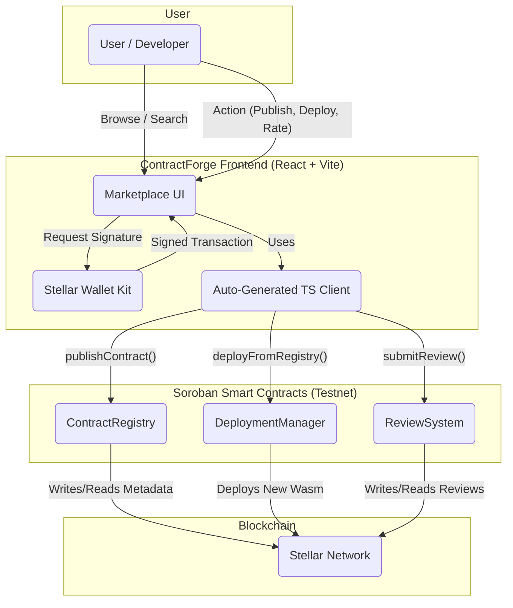

# ContractForge

**A Decentralized Marketplace and Registry for Stellar Smart Contracts.**

This project is a submission for the **Scaffold Stellar Hackathon** on DoraHacks.

* **Hackathon Page:** [https://dorahacks.io/hackathon/scaffoldstellar/detail](https://dorahacks.io/hackathon/scaffoldstellar/detail)
* **Live Demo URL:** [Link to your deployed Vercel/Netlify/Cloudflare Pages]
* **Video Demo:** [Link to your YouTube/Loom video]

---

## 1. The Problem

The Stellar Soroban ecosystem is powerful but new. As developers build complex dApps, they face significant challenges:

* **Code Duplication:** Developers constantly reinvent the wheel, writing boilerplate code for common standards (like tokens, DAOs, or escrows) that have been built before.
* **Discovery:** There is no central, trusted place to find, browse, and audit existing Soroban smart contracts.
* **Trust & Security:** It is difficult for a developer to know if a third-party contract is secure, audited, or adheres to best practices.

This friction slows down innovation and increases security risks for the entire ecosystem.

## 2. Our Solution: ContractForge

**ContractForge is an on-chain marketplace and registry that functions as an "NPM for Stellar Smart Contracts."**

It provides a central hub where developers can **publish**, **discover**, **verify**, and **deploy** reusable Soroban contracts with a single click. We turn the Scaffold Stellar framework's core concepts into a fully-fledged, user-friendly platform that empowers the entire developer community.

### Core Features

* **On-Chain Contract Registry:** A searchable, filterable database of Soroban smart contracts. Each entry includes detailed metadata, versioning, documentation, and a link to the source code.
* **One-Click Deployment:** A seamless deployment wizard that allows any developer to select a contract from the registry, configure its initialization parameters, and deploy their own instance of it directly to the network.
* **Community Rating & Review System:** A decentralized system for users and auditors to rate, review, and comment on contracts, building a social layer of trust and quality.
* **Verification Badges:** A framework for marking contracts as "Verified" (source code matches on-chain Wasm) or "Audited" (linked to a formal security audit).



## 3. Showcasing the Power of Scaffold Stellar

ContractForge is not just *built with* Scaffold Stellar; it is a *meta-tool* designed to amplify the framework's core mission of accelerating developer experience (DevEx).

This project was chosen specifically to demonstrate a deep understanding of the Scaffold Stellar architecture and its most powerful, unique features:

1.  **Built on the Registry Concept:** The entire premise of ContractForge is a user-interface and governance layer built on top of the `stellar-scaffold-cli`'s built-in **Contract Registry** concept. We showcase how this feature can be used to create a powerful ecosystem tool.
2.  **Demonstrates End-to-End Workflow:** We provide a perfect, real-world demonstration of the entire framework workflow:
    * A developer **publishes** a contract (using our UI, which wraps the `registry publish` logic).
    * A consumer **deploys** that contract (using our `DeploymentManager` contract).
    * The consumer's frontend instantly benefits from the **auto-generated TypeScript client**, a key feature of Scaffold Stellar.
3.  **Highlights Developer Tooling:** This project directly serves the same audience as the Scaffold Stellar team: developers. By building a tool that helps other developers build faster and safer, we align perfectly with the hackathon's "Open Innovation" theme.

## 4. Hackathon Requirements Checklist

We have successfully met all mandatory submission requirements:

* [x] **Deployed Smart Contract:** The platform runs on a multi-contract architecture using Rust/Wasm on the Stellar Testnet. This includes:
    * `ContractRegistry`: Manages all metadata, categories, and publishing logic.
    * `DeploymentManager`: Handles the on-chain logic for deploying new contract instances from the registry.
    * `ReviewSystem`: Manages ratings, reviews, and developer comments.
* [x] **Functional Frontend:** A complete React + TypeScript + Vite frontend (bootstrapped with Scaffold Stellar) provides a full user experience for browsing, searching, and deploying contracts.
* [x] **Stellar Wallet Kit Integration:** The frontend is fully integrated with the Stellar Wallet Kit. All on-chain actions (publishing, deploying, rating, reviewing) are authenticated and signed by the user's wallet.

## 5. Technical Architecture

ContractForge uses a robust, decoupled architecture. The React frontend communicates with our core Soroban smart contracts, which are deployed and managed using the Scaffold Stellar environment.

(Please see the Mermaid diagram code in the separate file `ARCHITECTURE.md` for a visual representation of the data flow.)

### Core Contracts

* **`ContractRegistry`**: The source of truth for all contract metadata.
* **`DeploymentManager`**: A "factory" contract that deploys new instances of registered contracts.
* **`ReviewSystem`**: A dedicated contract for handling user-generated content (ratings/reviews) to keep the main registry clean.

## 6. Running the Project Locally

### Prerequisites

* Rust
* Node.js (v18+) & pnpm
* Stellar CLI
* Scaffold Stellar CLI (`cargo install --locked stellar-scaffold-cli`)
* Docker

### Installation

1.  **Clone the repository:**
    ```bash
    git clone [your-repo-url]
    cd [your-repo-name]
    ```

2.  **Install dependencies:**
    ```bash
    pnpm install
    ```

3.  **Start the local network:**
    ```bash
    pnpm start:local_network
    ```

4.  **Deploy contracts** (in a new terminal):
    ```bash
    pnpm deploy:local
    ```

5.  **Run the web app** (in a new terminal):
    ```bash
    pnpm start:web
    ```

The application will be available at `http://localhost:5173`.

## 7. Future Roadmap

This hackathon project is the foundation for a critical piece of public infrastructure for the Stellar ecosystem.

* **GitHub/GitLab Integration:** Automatically pull source code from repositories, run verification checks, and publish new versions.
* **Formal Auditor Integration:** Create a special role for auditors to attach formal audit reports and "Audited" badges.
* **Gas & Deployment Cost Estimation:** Provide users with an estimated cost before they deploy a contract.
* **Contract Bundles:** Allow developers to publish "bundles" of contracts that work together (e.g., a "DeFi Starter Pack" with a Token, a Pool, and a Router).
