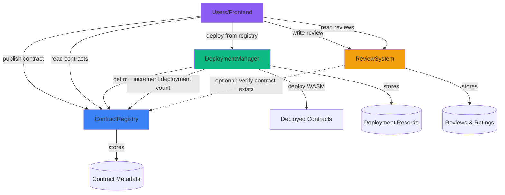
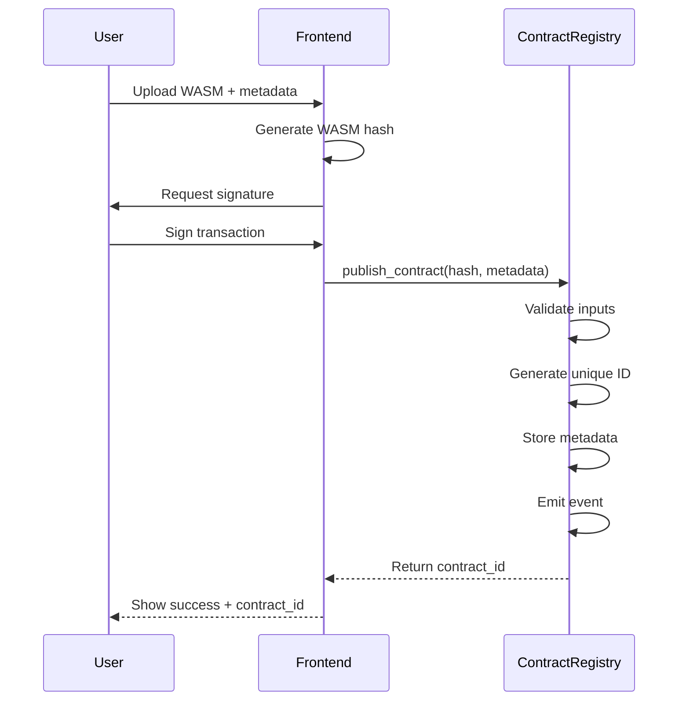
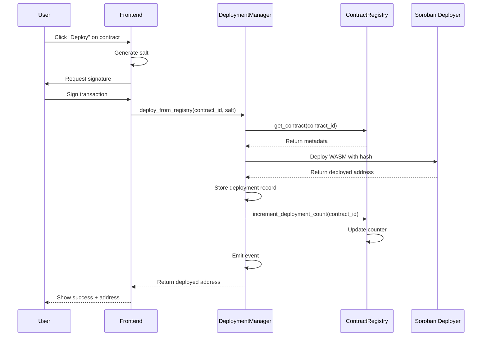
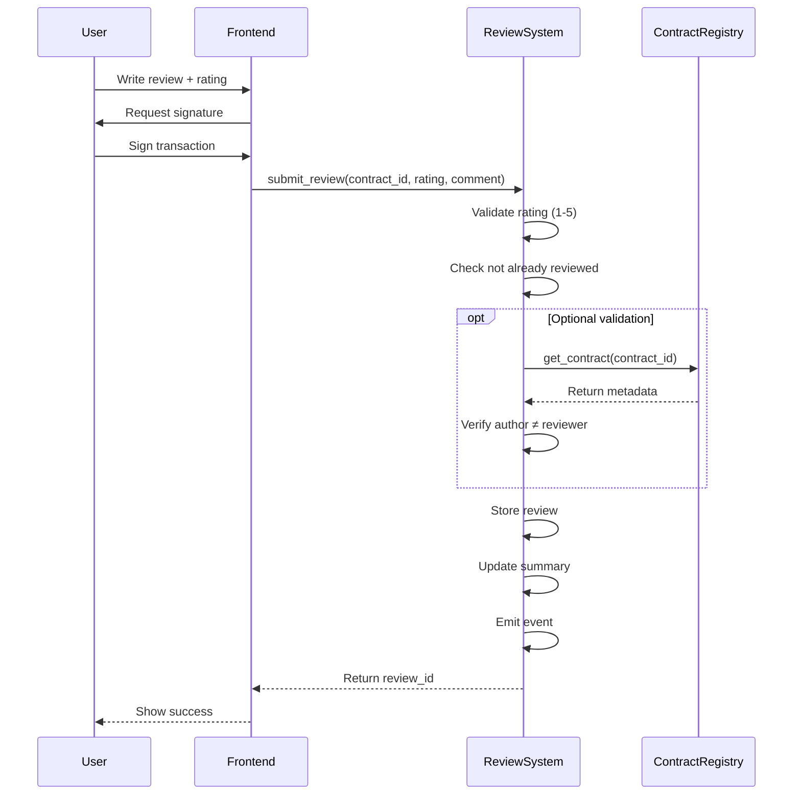

# Contract Dependencies and Architecture

## System Architecture Overview

ContractForge consists of three smart contracts that work together to create a decentralized marketplace for Soroban contracts.



## Contract Dependency Graph

### Dependency Levels

**Level 0 (No Dependencies):**

- **ContractRegistry** - Standalone contract
  - Does not depend on other ContractForge contracts
  - Stores contract metadata
  - Provides search and discovery

**Level 1 (Depends on Level 0):**

- **DeploymentManager** - Depends on ContractRegistry
  - Reads metadata from ContractRegistry
  - Updates deployment counts in ContractRegistry
  - Uses WASM hashes to deploy instances

- **ReviewSystem** - Optionally depends on ContractRegistry
  - Can verify contracts exist before allowing reviews
  - Can prevent authors from reviewing their own contracts
  - Works independently if validation is skipped

**Level 2 (User-facing):**

- **Frontend Application**
  - Interacts with all three contracts
  - Orchestrates user workflows
  - Displays aggregated data

## Data Flow Diagrams

### 1. Contract Publication Flow



### 2. Contract Deployment Flow



### 3. Review Submission Flow



## Deployment Order

Contracts must be deployed in dependency order:

### Order of Deployment

1. **First: ContractRegistry**

   ```bash
   stellar contract deploy \
     --wasm target/wasm32-unknown-unknown/release/contract_registry.wasm \
     --network local
   ```

   - No dependencies
   - Foundation of the system
   - Store the returned contract address

2. **Second: DeploymentManager**

   ```bash
   stellar contract deploy \
     --wasm target/wasm32-unknown-unknown/release/deployment_manager.wasm \
     --network local
   ```

   - Needs ContractRegistry address (passed as parameter)
   - Or configure to accept registry address in function calls

3. **Third: ReviewSystem**

   ```bash
   stellar contract deploy \
     --wasm target/wasm32-unknown-unknown/release/review_system.wasm \
     --network local
   ```

   - Optionally needs ContractRegistry address
   - Can work standalone

### Configuration in environments.toml

```toml
[local.contracts.contract-registry]
wasm = "target/wasm32-unknown-unknown/release/contract_registry.wasm"

[local.contracts.deployment-manager]
wasm = "target/wasm32-unknown-unknown/release/deployment_manager.wasm"
# Optional: init with registry address
# init = { registry = "CXXXXXXXXXXXXXXX" }

[local.contracts.review-system]
wasm = "target/wasm32-unknown-unknown/release/review_system.wasm"
# Optional: init with registry address
# init = { registry = "CXXXXXXXXXXXXXXX" }
```

## Cross-Contract Communication

### DeploymentManager → ContractRegistry

**Methods called:**

1. **get_contract(contract_id)**
   - Purpose: Fetch metadata before deployment
   - Returns: ContractMetadata
   - Usage: Get WASM hash to deploy

2. **increment_deployment_count(contract_id)**
   - Purpose: Update deployment counter
   - Returns: ()
   - Usage: Track deployment statistics

**Client generation:**

```rust
// In DeploymentManager contract
use contract_registry::Client as RegistryClient;

let registry_client = RegistryClient::new(&env, &registry_address);
let metadata = registry_client.get_contract(&contract_id);
```

### ReviewSystem → ContractRegistry (Optional)

**Methods called:**

1. **get_contract(contract_id)**
   - Purpose: Verify contract exists
   - Returns: ContractMetadata
   - Usage: Validate review target

**Implementation note:** This is optional for MVP to reduce coupling.

## Contract Interfaces Summary

### ContractRegistry

**Public Interface:**

```rust
// Write operations
fn publish_contract(...) -> Result<String, Error>
fn update_metadata(...) -> Result<(), Error>
fn verify_contract(...) -> Result<(), Error>
fn increment_deployment_count(...) -> Result<(), Error>

// Read operations
fn get_contract(contract_id: String) -> Result<ContractMetadata, Error>
fn get_all_contracts() -> Vec<ContractMetadata>
fn search_by_category(category: Category) -> Vec<ContractMetadata>
fn search_by_tag(tag: String) -> Vec<ContractMetadata>
```

### DeploymentManager

**Public Interface:**

```rust
// Write operations
fn deploy_from_registry(...) -> Result<Address, Error>

// Read operations
fn get_deployment(deployment_id: String) -> Result<DeploymentRecord, Error>
fn get_deployment_history(deployer: Address) -> Vec<DeploymentRecord>
fn get_contract_deployments(contract_id: String) -> Vec<DeploymentRecord>
fn get_all_deployments() -> Vec<DeploymentRecord>
fn get_total_deployments() -> u32
```

### ReviewSystem

**Public Interface:**

```rust
// Write operations
fn submit_review(...) -> Result<String, Error>
fn upvote_review(...) -> Result<(), Error>

// Read operations
fn get_review(review_id: String) -> Result<Review, Error>
fn get_reviews_for_contract(contract_id: String) -> Vec<Review>
fn get_reviews_by_user(reviewer: Address) -> Vec<Review>
fn get_review_summary(contract_id: String) -> ReviewSummary
```

## Data Relationships

### Primary Keys and Foreign Keys

```
ContractRegistry:
  Contract
    ├─ id (PK): String                    # Unique identifier
    └─ author: Address                     # Publisher

DeploymentManager:
  DeploymentRecord
    ├─ deployment_id (PK): String         # Unique identifier
    ├─ contract_id (FK): String           # → ContractRegistry.id
    ├─ deployer: Address                   # Who deployed
    └─ deployed_contract_address: Address  # Deployed instance

ReviewSystem:
  Review
    ├─ review_id (PK): String             # Unique identifier
    ├─ contract_id (FK): String           # → ContractRegistry.id
    └─ reviewer: Address                   # Who reviewed
```

### Entity Relationships

```
Contract 1:N DeploymentRecord
  - One contract can have many deployments
  - One deployment belongs to one contract

Contract 1:N Review
  - One contract can have many reviews
  - One review is for one contract

User 1:N DeploymentRecord
  - One user can have many deployments
  - One deployment by one user

User 1:N Review
  - One user can write many reviews
  - One review by one user

User 1:1 Review per Contract
  - One user can only review each contract once (anti-spam)
```

## Event System

### Event Flow

Contracts emit events that can be listened to by:

- Frontend (real-time updates)
- Indexers (historical data)
- Analytics (usage statistics)

**ContractRegistry Events:**

```rust
event ContractPublished(contract_id: String)
event ContractUpdated(contract_id: String)
event ContractVerified(contract_id: String, auditor: Address)
event ContractDeployed(contract_id: String, new_count: u32)
```

**DeploymentManager Events:**

```rust
event Deployed(deployment_id: String, contract_id: String, deployed_address: Address, deployer: Address)
```

**ReviewSystem Events:**

```rust
event ReviewSubmitted(review_id: String, contract_id: String, rating: u32)
event ReviewUpvoted(review_id: String, voter: Address)
```

## Integration Points for Frontend

### TypeScript Client Usage

```typescript
// 1. Import generated clients
import * as ContractRegistry from "contract-registry";
import * as DeploymentManager from "deployment-manager";
import * as ReviewSystem from "review-system";

// 2. Create client instances
const registryClient = new ContractRegistry.Client({
  contractId: ContractRegistry.CONTRACT_ID,
  networkPassphrase: "Standalone Network ; February 2017",
  rpcUrl: "http://localhost:8000/soroban/rpc",
  publicKey: walletAddress,
});

// Similar for DeploymentManager and ReviewSystem

// 3. Call methods
const allContracts = await registryClient.get_all_contracts();
const deployed = await deploymentManager.deploy_from_registry({
  registry_contract_id: ContractRegistry.CONTRACT_ID,
  contract_id: "contract_1",
  deployer: walletAddress,
  salt: generateSalt(),
});
```

### Frontend Data Aggregation

The frontend combines data from all contracts:

```typescript
// Get contract details
const contract = await registry.get_contract({ contract_id: "contract_5" });

// Get deployments of this contract
const deployments = await deploymentManager.get_contract_deployments({
  contract_id: "contract_5",
});

// Get reviews for this contract
const reviews = await reviewSystem.get_reviews_for_contract({
  contract_id: "contract_5",
});

// Get review summary
const summary = await reviewSystem.get_review_summary({
  contract_id: "contract_5",
});

// Display comprehensive contract page
displayContractDetails({
  ...contract,
  deploymentCount: deployments.length,
  averageRating: summary.average_rating / 100,
  totalReviews: summary.total_reviews,
  recentDeployments: deployments.slice(0, 5),
  topReviews: reviews.sort((a, b) => b.upvotes - a.upvotes).slice(0, 3),
});
```

## Security Considerations

### Trust Boundaries

1. **ContractRegistry is trusted**
   - DeploymentManager trusts metadata from registry
   - ReviewSystem optionally trusts contract existence

2. **Cross-contract authentication**
   - DeploymentManager verifies it's calling correct ContractRegistry
   - Protection: Use hardcoded or constructor-set addresses

3. **User authentication**
   - All write operations require signatures
   - No proxy attacks via contract calls

### Attack Vectors and Mitigations

1. **Fake Contract Registry**
   - Risk: DeploymentManager calls malicious registry
   - Mitigation: Hardcode or carefully initialize registry address

2. **Reentrancy**
   - Risk: Cross-contract calls with reentrancy
   - Mitigation: Soroban has built-in reentrancy protection

3. **Front-running**
   - Risk: Someone deploys before you
   - Mitigation: Use salt for deterministic addresses

4. **Spam**
   - Risk: Unlimited contract publications or reviews
   - Mitigation: Authentication required, one review per contract

## Scalability Considerations

### For MVP (Local/Testnet):

- Store all data on-chain
- Simple iteration for queries
- No pagination

### For Production (Mainnet):

- Implement pagination for large result sets
- Use temporary storage for caching
- Consider off-chain indexing for complex queries
- Add storage fees to discourage spam

## Summary

**Deployment Order:**

1. ContractRegistry (no dependencies)
2. DeploymentManager (depends on ContractRegistry)
3. ReviewSystem (optional dependency on ContractRegistry)

**Data Flow:**

- Users publish contracts → ContractRegistry
- Users deploy from registry → DeploymentManager → ContractRegistry
- Users review contracts → ReviewSystem → (optional) ContractRegistry

**Integration:**

- All contracts are independent (loose coupling)
- Cross-contract calls use generated clients
- Frontend aggregates data from all three contracts
- Events enable real-time updates

This architecture enables a scalable, modular marketplace where each contract has a single responsibility and can be upgraded independently.
